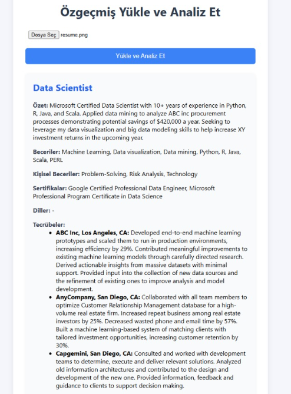

# Resume Parser API (OpenAI + FastAPI + Docker)

Bu proje, PDF, DOCX, TXT, JPG, PNG gibi özgeçmiş (CV) dosyalarını yükleyip, OpenAI API ile yapılandırılmış şekilde özetleyen ve JSON olarak sunan bir REST API sağlar.  
Ayrıca, dosya yükleyebileceğiniz ve sonucu kart şeklinde görebileceğiniz basit bir web arayüzü de içerir.

## Proje Amacı ve Özeti

- Farklı formatlarda (pdf, docx, txt, jpg, png) özgeçmiş dosyalarını analiz ederek, insan kaynakları süreçlerinde otomatik ve hızlı ön inceleme sağlamak.
- OpenAI API ile başlık, özet, tecrübeler, teknik ve kişisel beceriler, sertifikalar ve dilleri otomatik olarak çıkarmak.
- Sonucu Pydantic modeliyle yapılandırılmış JSON olarak sunmak ve kullanıcıya sade, anlaşılır bir arayüzde göstermek.
- Proje tamamen Docker ile izole çalışır, ek sanal ortama gerek yoktur.

## Projede Neler Yaptım?

- FastAPI ile REST API ve Swagger arayüzü kuruldu.
- PDF, DOCX, TXT, JPG, PNG dosyalarından metin çıkarımı için textract ve pytesseract kullanıldı.
- OpenAI API ile özgeçmişten yapılandırılmış veri çıkarımı sağlandı.
- Sonuçlar Pydantic ile tip güvenli şekilde işlendi.
- Modern ve sade bir HTML/CSS arayüzü ile dosya yükleme ve kart yapısında sonuç gösterimi sağlandı.
- Docker ve Docker Compose ile kolay kurulum ve dağıtım imkanı sunuldu.

## Sonuç Nasıl Görünüyor?

Aşağıda, uygulamanın çalıştırılması sonrası elde edilen örnek bir sonuç ekranı görebilirsiniz:



## Kurulum

### 1. Gerekli Dosyalar

- `Dockerfile`
- `docker-compose.yml`
- `.env` (OpenAI API anahtarınızı buraya yazın)
- `requirements.txt`
- `main.py`, `models.py`, `extractor.py`, `openai_structurer.py`
- `static/index.html`

### 2. .env Dosyası

Proje kök dizinine `.env` dosyası oluşturun ve aşağıdaki satırı ekleyin:

```
OPENAI_API_KEY=YOUR_OPENAI_API_KEY
```

### 3. Docker ile Çalıştırma

```sh
docker compose build --no-cache
docker compose up
```

### 4. Uygulamayı Kullanma

- API dokümantasyonu: [http://localhost:8000/docs](http://localhost:8000/docs)
- Web arayüzü: [http://localhost:8000/](http://localhost:8000/)

### 5. API Kullanımı

#### Özgeçmiş Yükleme (Swagger veya Web Arayüzü ile)

- `/parse_resume` endpointine dosya yükleyin.
- Sonuç yapılandırılmış JSON olarak döner.

#### Örnek JSON Yanıtı

```json
{
  "title": "Data Scientist",
  "summary": "10+ yıl tecrübeli veri bilimci...",
  "experiences": [
    {
      "company": "ABC Inc",
      "summary": "Makine öğrenmesi projeleri geliştirdi..."
    }
  ],
  "skills": ["Python", "Machine Learning"],
  "soft_skills": ["Problem-Solving"],
  "certificates": ["Google Certified Professional Data Engineer"],
  "languages": ["English", "Turkish"]
}
```

## Geliştirici Notları

- OpenAI API anahtarınızı kimseyle paylaşmayın.
- Proje tamamen Docker ile izole çalışır, ek sanal ortama gerek yoktur.
- Tesseract ve textract gibi bağımlılıklar Dockerfile ile otomatik kurulur.

## Katkı ve Lisans

- Pull request ve katkılara açıktır.
- [MIT License](LICENSE)

## Hızlı Başlangıç

```sh
git clone https://github.com/kullanici_adiniz/proje-adi.git
cd proje-adi
# .env dosyasını oluşturun ve OpenAI API anahtarınızı ekleyin
docker compose build --no-cache
docker compose up
```

## İletişim

Her türlü soru ve öneri için issue açabilirsiniz.